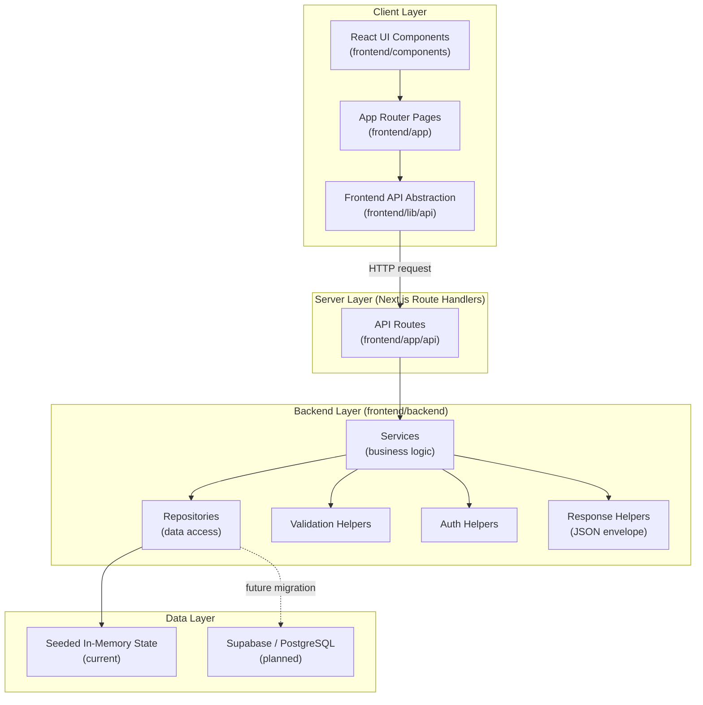
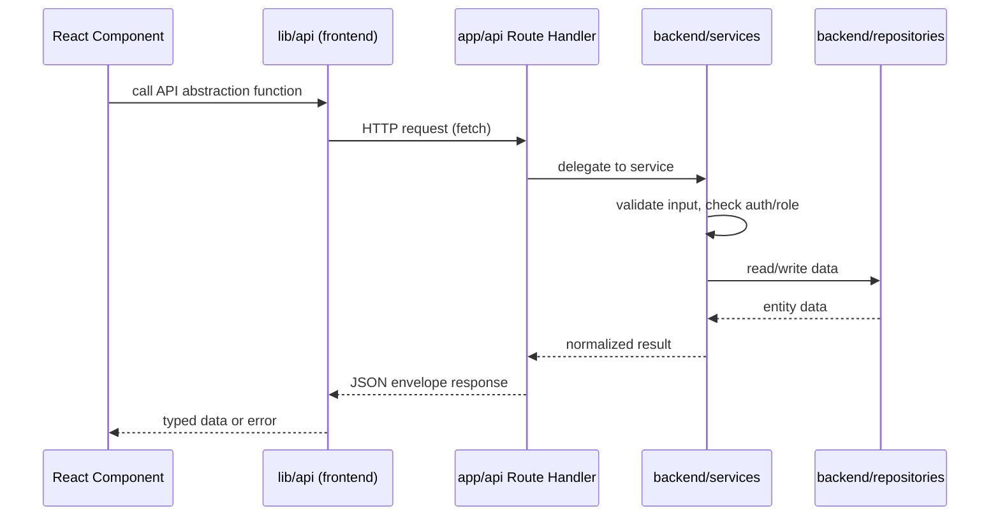
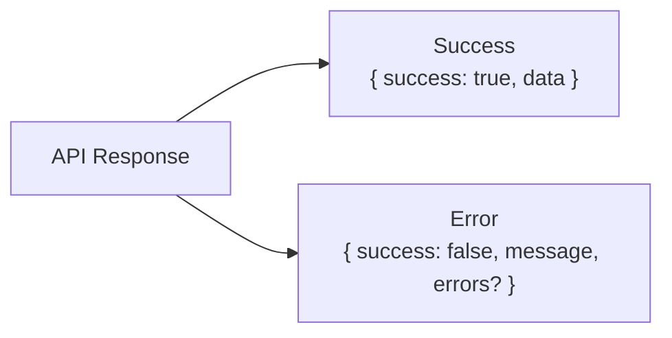
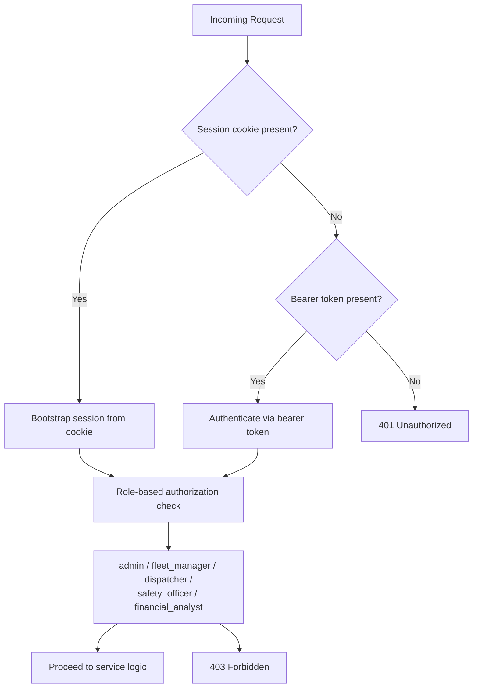
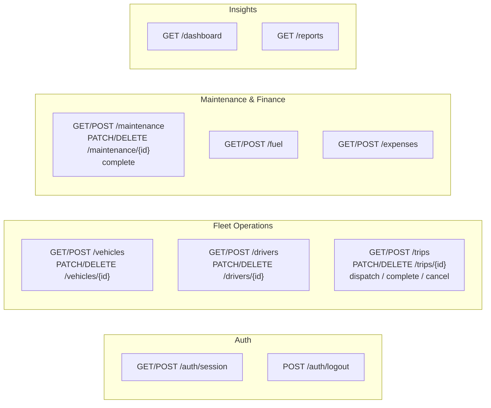
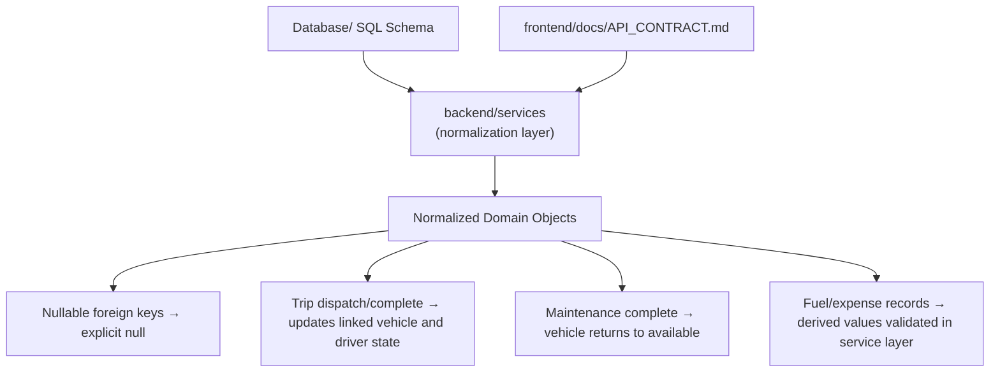
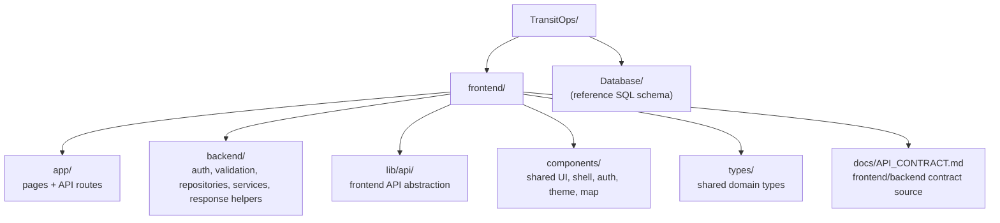
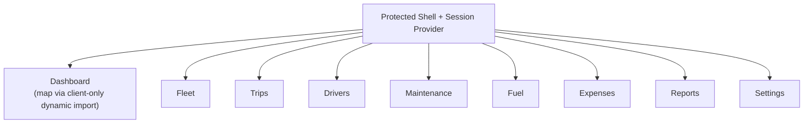

# TransitOps Architecture

## Overview

TransitOps is a Next.js-based smart transport operations platform. The application follows a thin-server, shared-contract architecture, where the frontend, API route handlers, and backend service layer are cleanly separated but co-located within a single Next.js application. This document describes the system architecture, request flow, and directory structure.

## High-Level Architecture

## Request Lifecycle

Every client-side data operation follows the same five-step path, keeping route handlers thin and business logic centralized.

## Response Envelope

All API responses follow a standardized JSON envelope, returned via the shared response helpers.

## Authentication and Authorization Flow

## Implemented API Surface

## Data Model Normalization

The frontend contract and the underlying SQL schema are not identical in shape. The service layer is responsible for reconciling the two.

## Directory Structure

## Frontend Composition

Notes:
- The dashboard map is loaded via a client-only dynamic import so that Leaflet, which depends on browser globals, does not break server-side rendering.
- The visual design system is intentionally monochrome, minimal, and free of gradients.

## Current State and Roadmap

| Layer | Current Implementation | Planned Migration |
|---|---|---|
| Persistence | Seeded in-memory state | Supabase / PostgreSQL |
| Auth | Cookie session + bearer token fallback, Supabase-aware helpers | Full Supabase-backed auth |
| API Contract | Fully implemented per `API_CONTRACT.md` | Stable; backend swap should not change contract |

## Orientation for New Contributors

For the fastest ramp-up on the codebase, review the following in order:

1. `frontend/docs/API_CONTRACT.md` — the source of truth for the API contract
2. `frontend/backend/services/` — the business logic layer
3. `frontend/app/api/` — the thin route handlers that expose the services
