# TransitOps System Architecture

## Table of Contents

- [Overview](#overview)
- [Design Principles](#design-principles)
- [Technology Stack](#technology-stack)
- [Part I — Application Architecture](#part-i--application-architecture)
  - [High-Level Architecture](#high-level-architecture)
  - [Request Lifecycle](#request-lifecycle)
  - [Response Envelope](#response-envelope)
  - [Authentication and Authorization Flow](#authentication-and-authorization-flow)
  - [Implemented API Surface](#implemented-api-surface)
  - [Data Model Normalization](#data-model-normalization)
  - [Directory Structure](#directory-structure)
  - [Frontend Composition](#frontend-composition)
- [Part II — Database Architecture](#part-ii--database-architecture)
  - [Entity Relationship Diagram](#entity-relationship-diagram)
  - [Tables](#tables)
  - [Relationships](#relationships)
  - [User Roles](#user-roles)
  - [Lifecycle States](#lifecycle-states)
  - [Business Modules](#business-modules)
  - [Security Model](#security-model)
  - [Database Roadmap](#database-roadmap)
- [Current State and Roadmap](#current-state-and-roadmap)
- [Known Limitations](#known-limitations)
- [Orientation for New Contributors](#orientation-for-new-contributors)

## Overview

TransitOps is a contract-first smart transport operations platform built with Next.js. It brings the full fleet workflow — vehicles, drivers, trips, maintenance, fuel, expenses, dashboard insights, and reporting — into a single governed workspace. The system follows a thin-server, shared-contract architecture, where the frontend, API route handlers, and backend service layer are cleanly separated but co-located within one Next.js application, and enforces fleet business rules such as dispatch eligibility, status transitions, and role-based access at the service layer rather than in the UI.

This document is the single source of truth for the system's architecture: how the application is structured and how it behaves at runtime (Part I), and the relational data model it is designed to run against (Part II).

## Design Principles

- **Contract-first**: the UI and API layer are built against the same explicit contract (`frontend/docs/API_CONTRACT.md`), so either side can evolve independently as long as the contract holds.
- **Thin routes, thick services**: route handlers do no business logic of their own; they validate transport concerns and delegate everything else to `backend/services`.
- **Persistence-agnostic core**: business logic is written against repository interfaces, not a specific datastore, so the current seeded in-memory store can be swapped for Supabase/PostgreSQL without touching services or the frontend contract.
- **Centralized cross-cutting concerns**: authentication, validation, and response formatting are implemented once and reused across every route.
- **Database-enforced integrity**: the data model is designed so that referential integrity, role access, and auditing are guaranteed at the database layer, not only in application code.

## Technology Stack

| Layer | Technologies |
|---|---|
| Framework | Next.js, React, TypeScript |
| Styling | Tailwind CSS |
| Data fetching / state | React Query |
| Forms and validation | React Hook Form, Zod |
| UI primitives | Lucide React |
| Mapping | Leaflet, React Leaflet |
| API layer | Next.js Route Handlers |
| Backend logic | Shared services and repositories (`frontend/backend`) |
| Auth | Supabase Auth, Supabase-compatible auth helpers |
| Caching (optional) | Redis, for repository bootstrap and repeated reads |
| Planned persistence | Supabase / PostgreSQL |

---

## Part I — Application Architecture

### High-Level Architecture

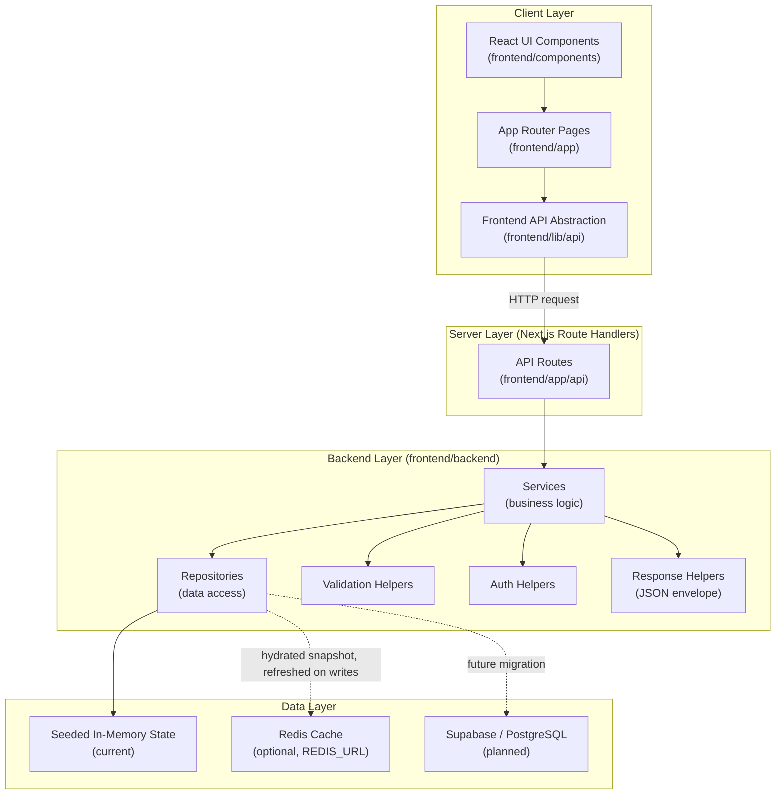

### Request Lifecycle

Every client-side data operation follows the same path, keeping route handlers thin and business logic centralized.

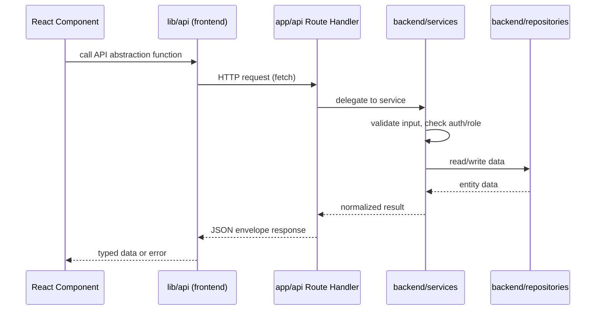

### Response Envelope

All API responses follow a standardized JSON envelope, returned via the shared response helpers.

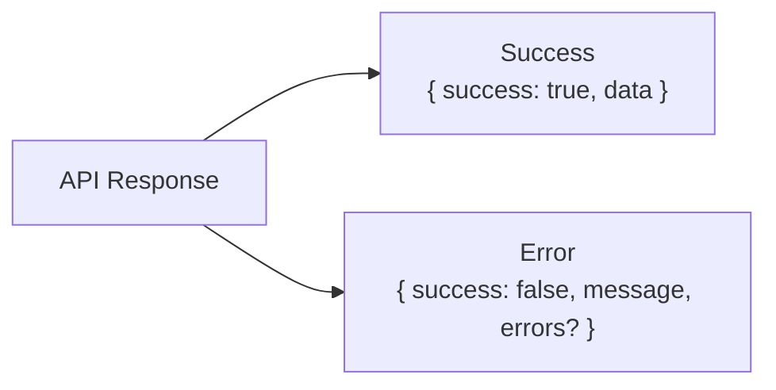

### Authentication and Authorization Flow

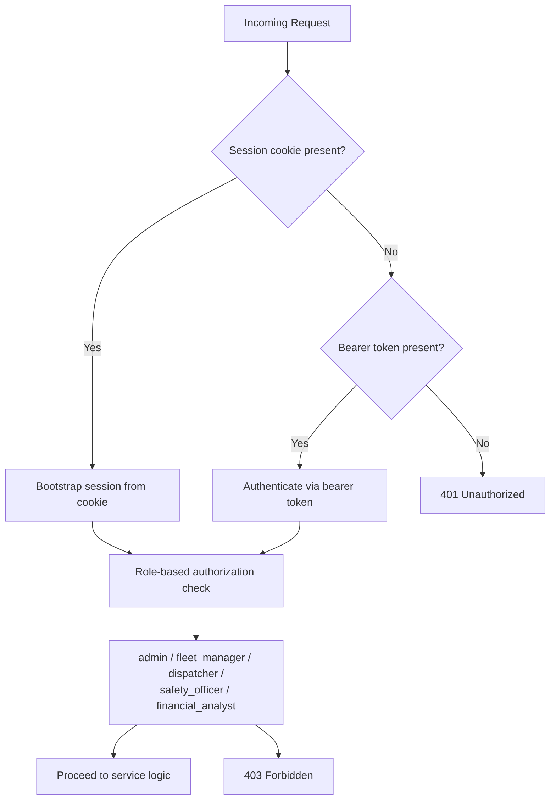

### Implemented API Surface

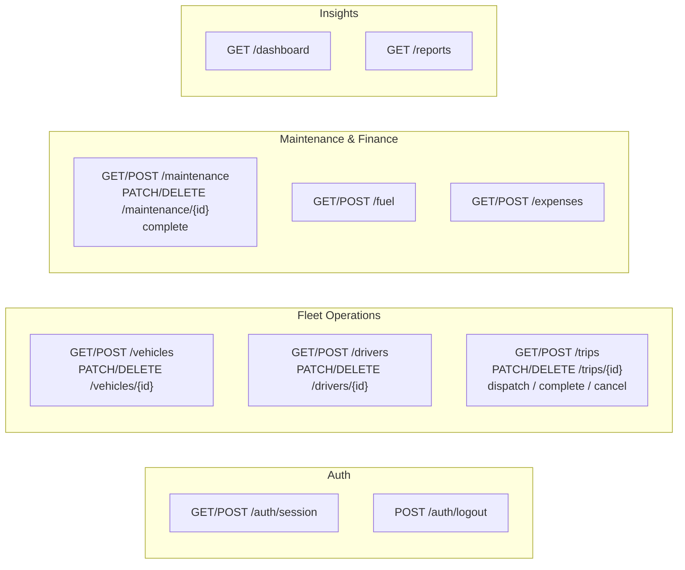

### Data Model Normalization

The frontend contract and the underlying SQL schema are not identical in shape. The service layer is responsible for reconciling the two.

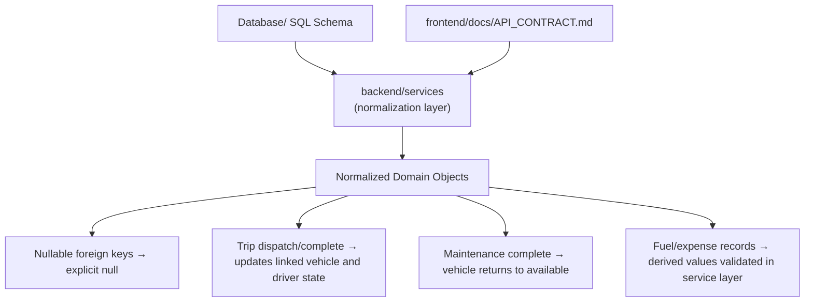

### Directory Structure

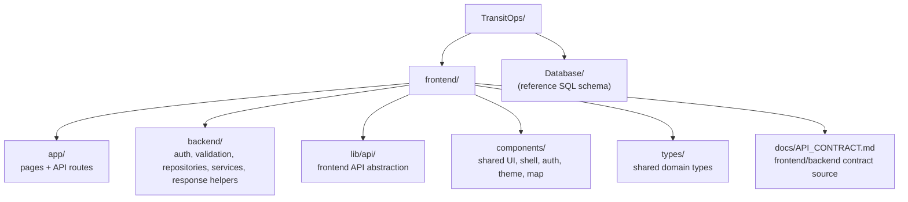

### Frontend Composition

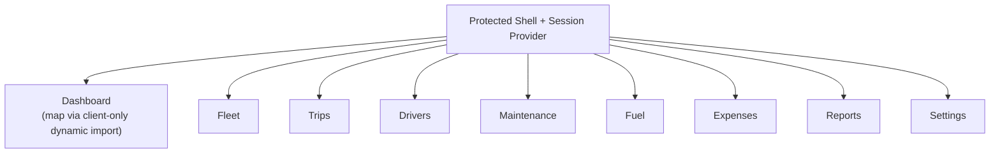

Notes:
- The dashboard map is loaded via a client-only dynamic import so that Leaflet, which depends on browser globals, does not break server-side rendering.
- The visual design system is intentionally monochrome, minimal, and free of gradients.

---

## Part II — Database Architecture

TransitOps is designed against a Supabase PostgreSQL schema. The data model uses UUID primary keys throughout, enforces referential integrity with foreign keys, and is built for production-grade operation with indexes, triggers, and Row Level Security (RLS).

### Entity Relationship Diagram

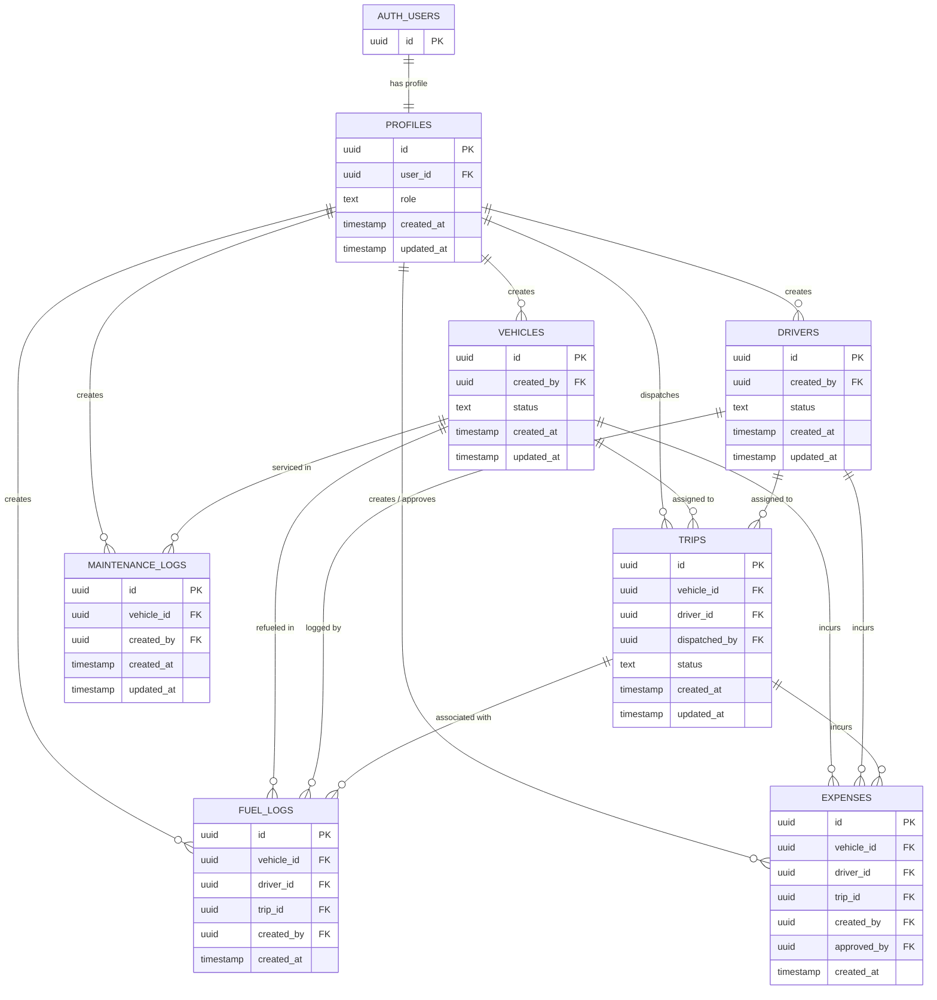

### Tables

| Table | Purpose |
|---|---|
| `profiles` | User profiles linked to `auth.users`, carrying the application-level role |
| `vehicles` | Fleet vehicle master data |
| `drivers` | Driver master data |
| `trips` | Trip scheduling and execution |
| `maintenance_logs` | Vehicle maintenance history |
| `fuel_logs` | Fuel transactions |
| `expenses` | Operational expense records |

### Relationships

| Foreign Key | References |
|---|---|
| `profiles.id` | `auth.users(id)` |
| `vehicles.created_by` | `profiles.id` |
| `drivers.created_by` | `profiles.id` |
| `trips.vehicle_id` | `vehicles.id` |
| `trips.driver_id` | `drivers.id` |
| `trips.dispatched_by` | `profiles.id` |
| `maintenance_logs.vehicle_id` | `vehicles.id` |
| `maintenance_logs.created_by` | `profiles.id` |
| `fuel_logs.vehicle_id` | `vehicles.id` |
| `fuel_logs.driver_id` | `drivers.id` |
| `fuel_logs.trip_id` | `trips.id` |
| `fuel_logs.created_by` | `profiles.id` |
| `expenses.vehicle_id` | `vehicles.id` |
| `expenses.driver_id` | `drivers.id` |
| `expenses.trip_id` | `trips.id` |
| `expenses.created_by` | `profiles.id` |
| `expenses.approved_by` | `profiles.id` |

### User Roles

Access control is role-based, with the following roles defined in `profiles` and enforced consistently across both the application service layer and the database RLS policies:

- `admin`
- `fleet_manager`
- `dispatcher`
- `safety_officer`
- `financial_analyst`

### Lifecycle States

**Vehicle Status**

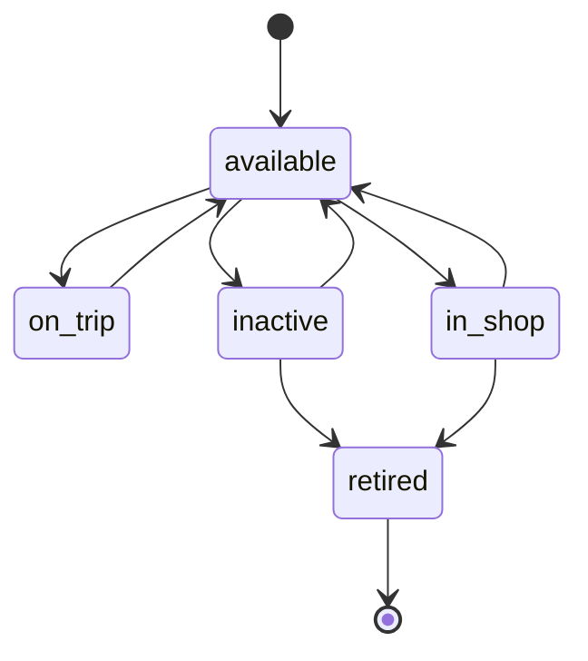

**Driver Status** (recommended lifecycle)

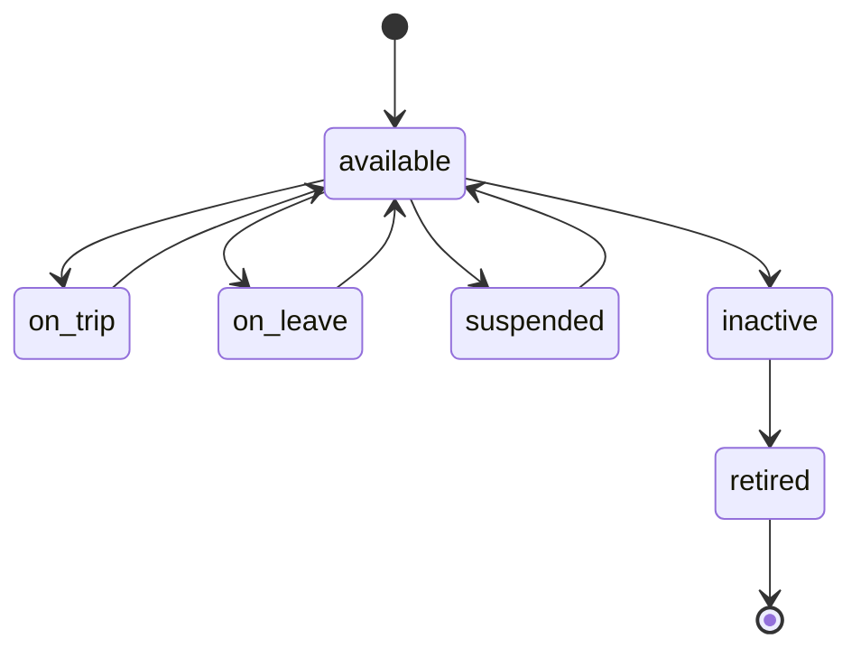

### Business Modules

| Module | Responsibilities |
|---|---|
| Fleet | Vehicle registration, vehicle lifecycle, availability tracking |
| Driver Management | Licensing, employment details, driver assignment |
| Trip Management | Scheduling, dispatching, completion, cancellation |
| Maintenance | Preventive maintenance, corrective maintenance, service history |
| Fuel | Fuel purchases, consumption tracking |
| Finance | Operational expenses, cost reporting |

### Security Model

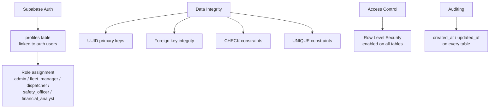

Summary:

- Authentication is handled by Supabase Auth, with `profiles` linked one-to-one to `auth.users`.
- Every table uses UUID primary keys and enforces foreign key integrity.
- CHECK and UNIQUE constraints guard data validity at the database level.
- Row Level Security is enabled on all tables, so access is enforced at the database layer, not only in application code.
- All tables carry `created_at` and `updated_at` for timestamp auditing.

### Database Roadmap

| Order | Item |
|---|---|
| 1 | Authorization helper functions |
| 2 | RLS policy refinement |
| 3 | Business logic triggers |
| 4 | Dashboard SQL views |
| 5 | RPC functions |
| 6 | Performance optimization |

---

## Current State and Roadmap

| Layer | Current Implementation | Planned Migration |
|---|---|---|
| Persistence | Seeded in-memory state, optionally cached in Redis | Supabase / PostgreSQL |
| Auth | Cookie session + bearer token fallback, Supabase-aware helpers | Full Supabase-backed auth |
| API Contract | Fully implemented per `API_CONTRACT.md` | Stable; backend swap should not change contract |
| Database Schema | Complete: tables, relationships, indexes, triggers, RLS defined | Ready for authentication integration and application development |

## Known Limitations

- Persistence is currently mock or semi-mock rather than a live database-backed store.
- The reports view is implemented, but CSV export is not yet exposed in the UI.
- PDF export, email reminders, and vehicle document management are described in the assignment brief but not yet implemented.
- The settings screen holds local mock state and does not persist changes.

## Orientation for New Contributors

For the fastest ramp-up on the codebase, review the following in order:

1. `frontend/docs/API_CONTRACT.md` — the source of truth for the API contract
2. `frontend/backend/services/` — the business logic layer
3. `frontend/app/api/` — the thin route handlers that expose the services
4. Part II of this document — the underlying relational data model
